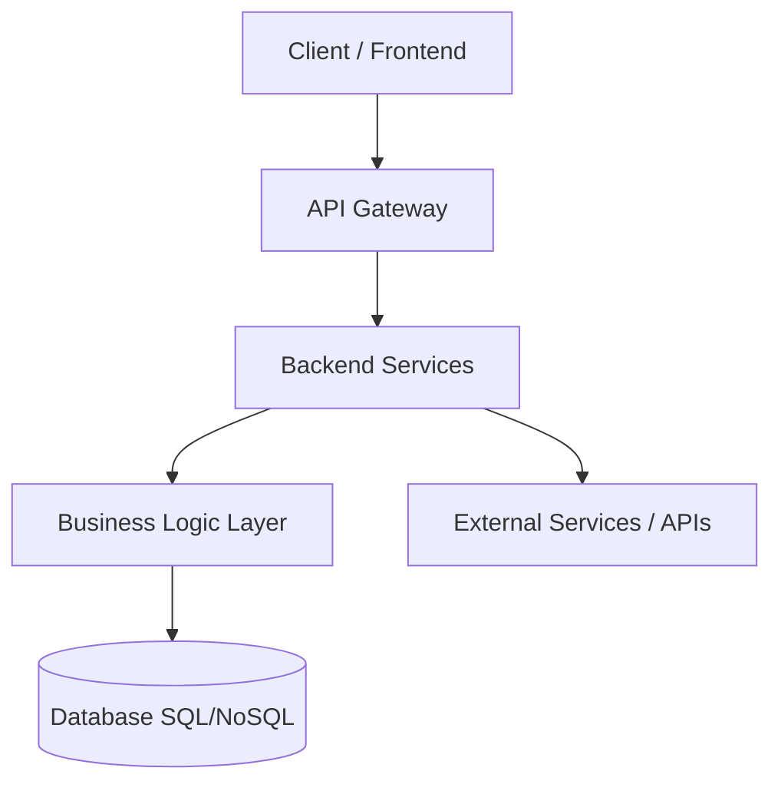

# 🚀 Blackfight1022 — Software Engineer (Backend / System Design)

  

  

  <b>Building reliable, scalable and maintainable software systems with strong engineering fundamentals.</b>

---

## 🧠 About (Engineering Summary)

Software Engineer focused on backend systems, API design, and scalable architecture. I specialize in building production-ready applications using modern JavaScript ecosystems, with emphasis on system reliability, maintainability, and performance.

Core mindset: **simplicity, scalability, and correctness over complexity.**

---

## 🎯 Engineering Focus Areas

* Backend systems design & API architecture
* Distributed system fundamentals
* Scalable service design (modular & stateless)
* Database modeling (SQL / NoSQL)
* Performance optimization & bottleneck analysis
* Software quality (testing & validation strategies)

---

## 🏗️ System Design Overview

### Architecture Principles

* Separation of concerns (layered architecture)
* Stateless services where possible
* Horizontal scalability readiness
* Fail-safe and resilient API design

### Common Patterns Used

* Controller → Service → Repository
* Event-driven architecture (conceptual)
* RESTful API standards
* Modular monolith evolution path

---

## 🧩 Reference Architecture

---

## ⚙️ Tech Stack

### Frontend

### Backend

### Databases

### Tools

---

## 🚀 Selected Engineering Work

### 1. Scalable Backend API System

**Goal:** Design modular backend architecture for extensibility and maintainability

* RESTful API structure
* Authentication & authorization layer
* Service-based architecture

**Focus:** Scalability, maintainability, clean separation of concerns

---

### 2. Data-Driven Dashboard (React)

**Goal:** Build responsive UI consuming high-frequency API data

* Component-driven architecture
* Optimized rendering strategy
* API integration layer

**Focus:** UI performance and clean frontend architecture

---

### 3. REST API Engineering Project

**Goal:** Build production-ready API with proper standards

* Clean REST design principles
* Proper HTTP semantics
* Postman-based validation workflow

**Focus:** Reliability, structure, and testability

---

## 🧪 Software Quality

* Unit & integration testing principles
* API contract validation
* Error handling strategies
* Input validation & security basics

---

## 📊 Engineering Signals

* System maintainability
* API response consistency
* Query efficiency
* Architectural modularity

---

## 🛠️ Core Principles

* Build simple systems that scale
* Prefer explicit design over implicit behavior
* Optimize when necessary, not prematurely
* Design for failure and recovery

---

## 📫 Contact

* 💼 LinkedIn: [https://www.linkedin.com/in/jesús-cabrejo-71b871323](https://www.linkedin.com/in/jesús-cabrejo-71b871323)
* 💻 GitHub: [https://github.com/blackfight1022](https://github.com/blackfight1022)
* 📧 Email: [esmic20181022@gmail.com](mailto:esmic20181022@gmail.com)

---

## 🧭 Engineering Philosophy

> “Good engineering is about making systems understandable, reliable, and evolvable.”

  

